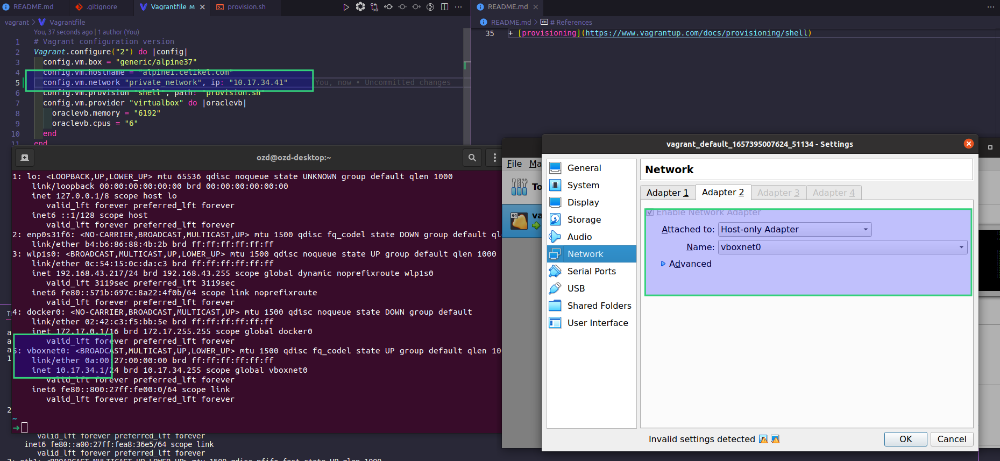
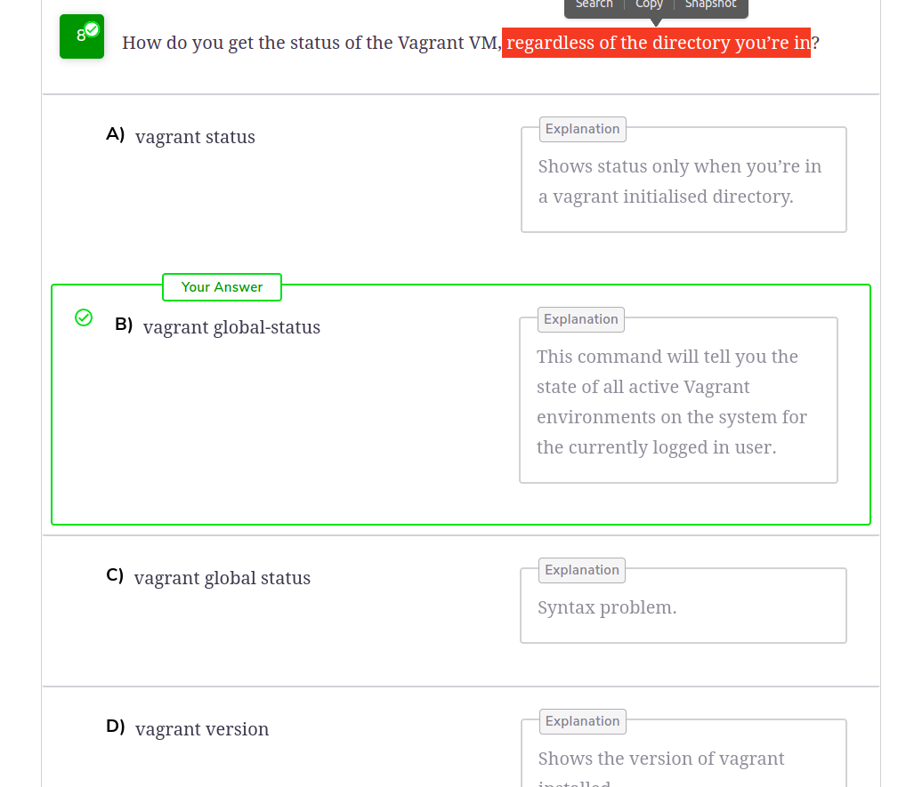
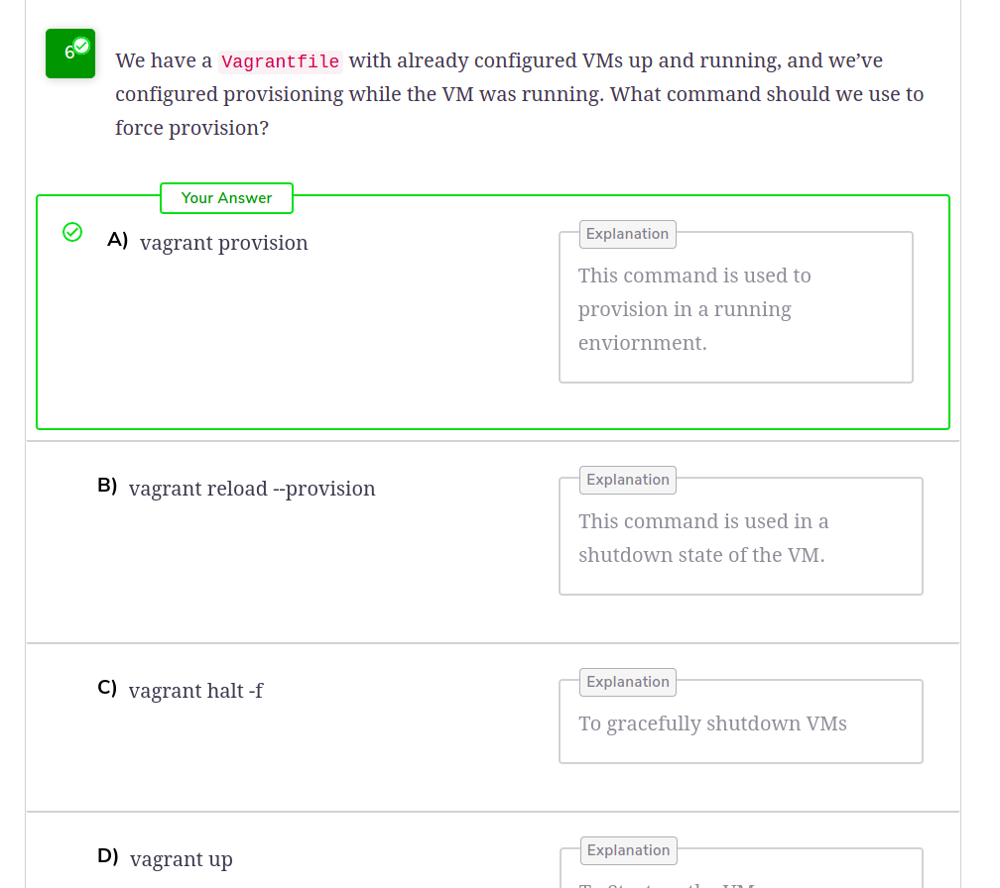
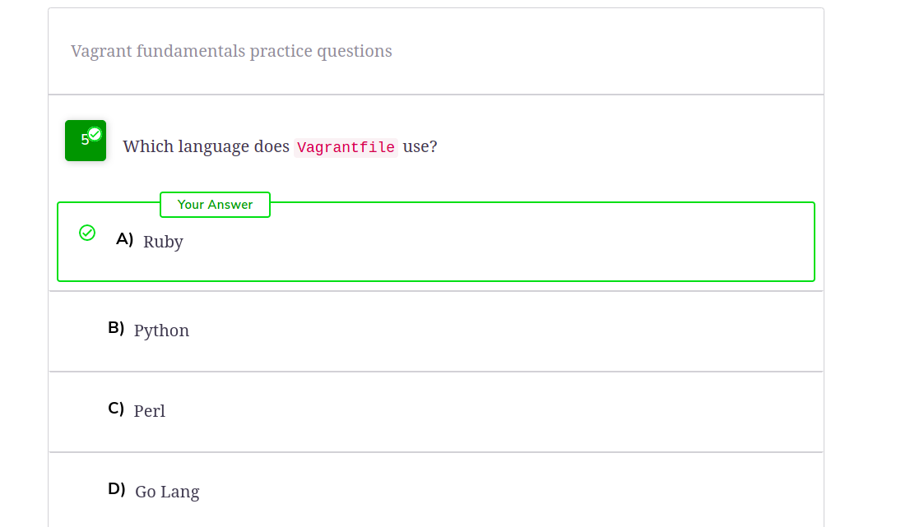
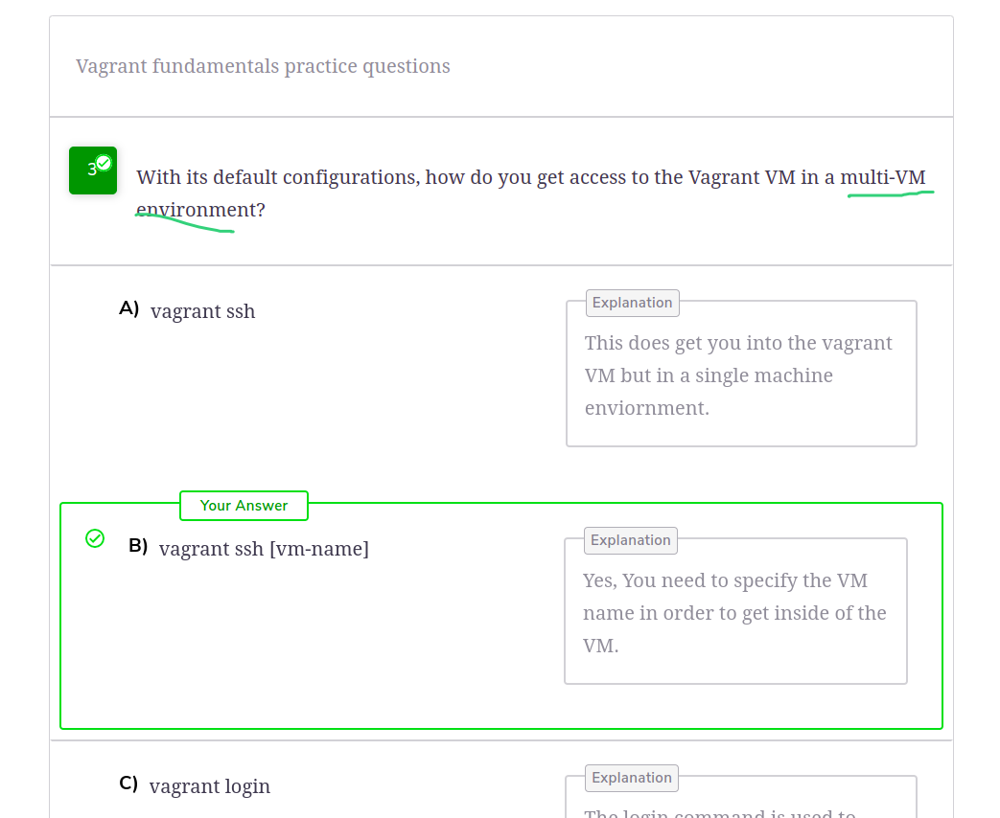

# Virtualization
Creation of virtual copy of your hardware resources, which can be done using any `virtualization` software.
## O/S Virtualization
Enables hardware to simultaneously run multiple copies of OSes on the same hardware.

Hypervisors = VMM (Virtual Machine Manager) = Software that enables virtualization

`TYPE1` Hypervisors : Directly runs on the hardware, act as the OS for the physical machine
(bare-metal hypervisor, server-side virtualization)
`TYPE2` Hypervisors : On top of existing OS (client-server virtualization)
# Vagrant
+ Works with any virtualization engine (libvirt, VMware, Virtualbox)
+ You need to have **one of these virtualization engines** for Vagrant to run a virtual O/S
+ There's a large community that is pushing their ready-to-go images onto `Vagrant Cloud`
+ Vagrantfile &rarr; Ruby language

---
---

# Install Hypervisor and Vagrant
```
sudo apt apdate
sudo apt install -y virtualbox virtualbox-ext-pack vagrant
```

# Some Vagrant Commands
```bash
# Current state of the Vagrant VM in your system, regardless of the directory
vagrant global-status
vagrant up <id>
vagrant ssh
vagrant global-status
vagrant halt <id> # graceful shutdown
```

```bash
cd vagrant ; vagrant status
vagrant up <id>
vagrant ssh
vagrant status
vagrant halt <id> # graceful shutdown
```

```bash
vagrant destroy # also, removes from virtualbox
```



## Aliases
+ Aliases can be defined within _VAGRANT_HOME/aliases_ file
+ *VAGRANT_HOME* can be set to change the directory where Vagrant stores global state. By default, this is set to *~/.vagrant.d*

## Quiz




# References
+ [Course Material](https://www.educative.io/courses/guide-to-vagrant-virtual-machines)
+ [alias](https://www.vagrantup.com/docs/cli/aliases)
+ [provisioning](https://www.vagrantup.com/docs/provisioning/shell)